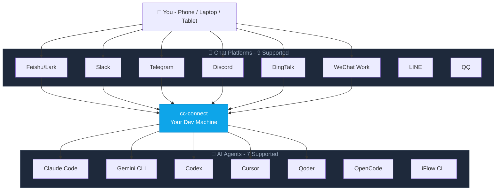

<p align="center">
  
</p>

<p align="center">
  <a href="https://github.com/chenhg5/cc-connect/actions/workflows/ci.yml">
    
  </a>
  <a href="https://github.com/chenhg5/cc-connect/releases">
    
  </a>
  <a href="https://www.npmjs.com/package/cc-connect">
    
  </a>
  <a href="https://github.com/chenhg5/cc-connect/blob/main/LICENSE">
    
  </a>
  <a href="https://goreportcard.com/report/github.com/chenhg5/cc-connect">
    
  </a>
</p>

<p align="center">
  <a href="https://discord.gg/kHpwgaM4kq">
    
  </a>
  <a href="https://t.me/+odGNDhCjbjdmMmZl">
    
  </a>
</p>

<p align="center">
  <a href="./README.md">English</a> | <a href="./README.zh-CN.md">中文</a>
</p>

---

<p align="center">
  <b>Control your local AI agents from any chat app. Anywhere, anytime.</b>
</p>

<p align="center">
  cc-connect bridges AI agents running on your machine to the messaging platforms you already use.<br/>
  Code review, research, automation, data analysis — anything an AI agent can do,<br/>
  now accessible from your phone, tablet, or any device with a chat app.
</p>



---

## ✨ Why cc-connect?

### 🤖 Universal Agent Support
**7 AI Agents** — Claude Code, Codex, Cursor Agent, Qoder CLI, Gemini CLI, OpenCode, iFlow CLI. Use whichever fits your workflow, or all of them at once.

### 📱 Platform Flexibility
**9 Chat Platforms** — Feishu, DingTalk, Slack, Telegram, Discord, WeChat Work, LINE, QQ, QQ Bot (Official). Most need **zero public IP**.

### 🔄 Multi-Agent Orchestration
**Multi-Bot Relay** — Bind multiple bots in a group chat and let them communicate with each other. Ask Claude, get insights from Gemini — all in one conversation.

### 🎮 Complete Chat Control
**Full Control from Chat** — Switch models (`/model`), tune reasoning (`/reasoning`), change permission modes (`/mode`), manage sessions, all via slash commands.

### 🧠 Persistent Memory
**Agent Memory** — Read and write agent instruction files (`/memory`) without touching the terminal.

### ⏰ Intelligent Scheduling
**Scheduled Tasks** — Set up cron jobs in natural language. *"Every day at 6am, summarize GitHub trending"* just works.

### 🎤 Multimodal Support
**Voice & Images** — Send voice messages or screenshots; cc-connect handles STT/TTS and multimodal forwarding.

### 📦 Multi-Project Architecture
**Multi-Project** — One process, multiple projects, each with its own agent + platform combo.

### 🌍 Multilingual Interface
**5 Languages** — Native support for English, Chinese (Simplified & Traditional), Japanese, and Spanish. Built-in i18n ensures everyone feels at home.

---

<p align="center">
  
  
  
</p>
<p align="center">
  <em>Left：Lark &nbsp;|&nbsp; Telegram &nbsp;|&nbsp; Right：Wechat</em>
</p>

---

## 🚀 Quick Start

### 🤖 Install & Configure via AI Agent (Recommended)

> **The easiest way** — Send this to Claude Code or any AI coding agent, and it will handle the entire installation and configuration for you:

```bash
Follow https://raw.githubusercontent.com/chenhg5/cc-connect/refs/heads/main/INSTALL.md to install and configure cc-connect.

IMPORTANT: Use interactive tools (like AskUserQuestion) to guide me through configuration choices:
- Agent selection (Claude Code, Cursor, Gemini, etc.)
- Platform selection (Feishu, Telegram, Discord, etc.)
- API keys and authentication tokens
- Project paths and preferences

Don't guess values—always ask me to choose via interactive prompts.
```

---

### 📦 Manual Install

**Via npm:**

```bash
# Stable version
npm install -g cc-connect

# Beta version (more features, may be unstable)
npm install -g cc-connect@beta
```

**Download binary from [GitHub Releases](https://github.com/chenhg5/cc-connect/releases):**

```bash
# Linux amd64 - Stable
curl -L -o cc-connect https://github.com/chenhg5/cc-connect/releases/latest/download/cc-connect-linux-amd64
chmod +x cc-connect
sudo mv cc-connect /usr/local/bin/

# Beta version (from pre-release)
curl -L -o cc-connect https://github.com/chenhg5/cc-connect/releases/download/v1.x.x-beta/cc-connect-linux-amd64
```

**Build from source (requires Go 1.22+):**

```bash
git clone https://github.com/chenhg5/cc-connect.git
cd cc-connect
make build
```

---

### ⚙️ Configure

```bash
mkdir -p ~/.cc-connect
cp config.example.toml ~/.cc-connect/config.toml
vim ~/.cc-connect/config.toml
```

---

### ▶️ Run

```bash
./cc-connect
```

---

### 🔄 Upgrade

```bash
# npm
npm install -g cc-connect

# Binary self-update
cc-connect update           # Stable
cc-connect update --pre     # Beta (includes pre-releases)
```

---

## 📊 Support Matrix

| Component | Type | Status |
|-----------|------|--------|
| Agent | Claude Code | ✅ Supported |
| Agent | Codex (OpenAI) | ✅ Supported |
| Agent | Cursor Agent | ✅ Supported |
| Agent | Gemini CLI (Google) | ✅ Supported |
| Agent | Qoder CLI | ✅ Supported |
| Agent | OpenCode (Crush) | ✅ Supported |
| Agent | iFlow CLI | ✅ Supported |
| Agent | Goose (Block) | 🔜 Planned |
| Agent | Aider | 🔜 Planned |
| Platform | Feishu (Lark) | ✅ WebSocket — no public IP needed |
| Platform | DingTalk | ✅ Stream — no public IP needed |
| Platform | Telegram | ✅ Long Polling — no public IP needed |
| Platform | Slack | ✅ Socket Mode — no public IP needed |
| Platform | Discord | ✅ Gateway — no public IP needed |
| Platform | LINE | ✅ Webhook — public URL required |
| Platform | WeChat Work | ✅ WebSocket / Webhook |
| Platform | QQ (NapCat/OneBot) | ✅ WebSocket — Beta |
| Platform | QQ Bot (Official) | ✅ WebSocket — no public IP needed |

---

## 📖 Platform Setup Guides

| Platform | Guide | Connection | Public IP? |
|----------|-------|------------|------------|
| Feishu (Lark) | [docs/feishu.md](docs/feishu.md) | WebSocket | No |
| DingTalk | [docs/dingtalk.md](docs/dingtalk.md) | Stream | No |
| Telegram | [docs/telegram.md](docs/telegram.md) | Long Polling | No |
| Slack | [docs/slack.md](docs/slack.md) | Socket Mode | No |
| Discord | [docs/discord.md](docs/discord.md) | Gateway | No |
| WeChat Work | [docs/wecom.md](docs/wecom.md) | WebSocket / Webhook | No (WS) / Yes (Webhook) |
| QQ / QQ Bot | [docs/qq.md](docs/qq.md) | WebSocket | No |

---

## 🎯 Key Features

### 💬 Session Management

```
/new [name]       Start a new session
/list             List all sessions
/switch <id>      Switch session
/current          Show current session
```

---

### 🔐 Permission Modes

```
/mode             Show available modes
/mode yolo        # Auto-approve all tools
/mode default     # Ask for each tool
```

---

### 🔄 Provider Management

```
/provider list              List providers
/provider switch <name>     Switch API provider at runtime
```

---

### ⏰ Scheduled Tasks

```bash
/cron add 0 6 * * * Summarize GitHub trending
```

📖 **Full documentation:** [docs/usage.md](docs/usage.md)

---

## 📚 Documentation

- [Usage Guide](docs/usage.md) — Complete feature documentation
- [INSTALL.md](INSTALL.md) — AI-agent-friendly installation guide
- [config.example.toml](config.example.toml) — Configuration template

---

## 👥 Community

- [Discord](https://discord.gg/kHpwgaM4kq)
- [Telegram](https://t.me/+odGNDhCjbjdmMmZl)

---

## 🙏 Contributors

<a href="https://github.com/chenhg5/cc-connect/graphs/contributors">
  
</a>

---

## ⭐ Star History

<a href="https://www.star-history.com/#chenhg5/cc-connect&Date">
 <picture>
   <source media="(prefers-color-scheme: dark)" srcset="https://api.star-history.com/svg?repos=chenhg5/cc-connect&type=Date&theme=dark" />
   <source media="(prefers-color-scheme: light)" srcset="https://api.star-history.com/svg?repos=chenhg5/cc-connect&type=Date" />
   
 </picture>
</a>

---

## 📄 License

MIT License

---

<p align="center">
  <sub>Built with ❤️ by the cc-connect community</sub>
</p>
