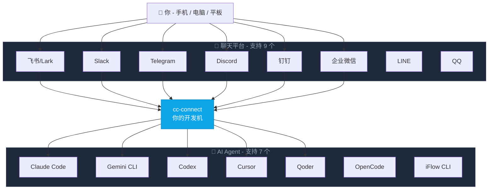

<p align="center">
  
</p>

<p align="center">
  <a href="https://github.com/chenhg5/cc-connect/actions/workflows/ci.yml">
    
  </a>
  <a href="https://github.com/chenhg5/cc-connect/releases">
    
  </a>
  <a href="https://www.npmjs.com/package/cc-connect">
    
  </a>
  <a href="https://github.com/chenhg5/cc-connect/blob/main/LICENSE">
    
  </a>
  <a href="https://goreportcard.com/report/github.com/chenhg5/cc-connect">
    
  </a>
</p>

<p align="center">
  <a href="https://discord.gg/kHpwgaM4kq">
    
  </a>
  <a href="https://t.me/+odGNDhCjbjdmMmZl">
    
  </a>
</p>

<p align="center">
  <a href="./README.md">English</a> | <a href="./README.zh-CN.md">中文</a>
</p>

---

<p align="center">
  <b>在任何聊天工具里，远程操控你的本地 AI Agent。随时随地，随心所欲。</b>
</p>

<p align="center">
  cc-connect 把运行在你机器上的 AI Agent 桥接到你日常使用的即时通讯工具。<br/>
  代码审查、资料研究、自动化任务、数据分析 —— 只要 AI Agent 能做的事，<br/>
  都能通过手机、平板或任何有聊天应用的设备来完成。
</p>



---

## ✨ 为什么选择 cc-connect？

### 🤖 通用 Agent 支持
**7 大 AI Agent** — Claude Code、Codex、Cursor Agent、Qoder CLI、Gemini CLI、OpenCode、iFlow CLI。按需选用，或同时使用全部。

### 📱 平台灵活性
**9 大聊天平台** — 飞书、钉钉、Slack、Telegram、Discord、企业微信、LINE、QQ、QQ 官方机器人。大部分**无需公网 IP**。

### 🔄 多 Agent 编排
**多机器人中继** — 在群聊中绑定多个机器人，让它们相互协作。问 Claude，再听 Gemini 的见解 — 同一个对话搞定。

### 🎮 完整的聊天控制
**聊天即控制** — 切换模型 (`/model`)、切换推理强度 (`/reasoning`)、切换权限模式 (`/mode`)、管理会话，全部通过斜杠命令完成。

### 🧠 持久化记忆
**Agent 记忆** — 在聊天中直接读写 Agent 指令文件 (`/memory`)，无需回到终端。

### ⏰ 智能定时任务
**定时任务** — 自然语言创建 cron 任务。"每天早上6点总结 GitHub trending" 即刻生效。

### 🎤 多模态支持
**语音 & 图片** — 发语音或截图，cc-connect 自动处理 STT/TTS 和多模态转发。

### 📦 多项目架构
**多项目管理** — 一个进程同时管理多个项目，各自独立的 Agent + 平台组合。

### 🌍 多语言界面
**5 种语言** — 原生支持英语、中文（简体/繁体）、日语和西班牙语。内置 i18n 让每个人都能得心应手。

---

<p align="center">
  
  
  
</p>
<p align="center">
  <em>左：飞书 &nbsp;|&nbsp; Telegram &nbsp;|&nbsp; 右：微信</em>
</p>

---

## 🚀 快速开始

### 🤖 通过 AI Agent 安装配置（推荐）

> **最简单的方式** — 把这段话发给 Claude Code 或其他 AI 编码 Agent，它会帮你完成整个安装和配置过程：

```bash
请参考 https://raw.githubusercontent.com/chenhg5/cc-connect/refs/heads/main/INSTALL.md 帮我安装和配置 cc-connect

重要提示：请使用交互式工具（如 AskUserQuestion）引导我完成配置选择：
- Agent 选择（Claude Code、Cursor、Gemini 等）
- 平台选择（飞书、Telegram、Discord 等）
- API 密钥和认证令牌
- 项目路径和个人偏好配置

不要猜测值——始终通过交互式提示让我选择或提供相关配置。
```

---

### 📦 手动安装

**通过 npm：**

```bash
# 稳定版
npm install -g cc-connect

# Beta 版（功能更新，可能不稳定）
npm install -g cc-connect@beta
```

**从 [GitHub Releases](https://github.com/chenhg5/cc-connect/releases) 下载：**

```bash
# Linux amd64 - 稳定版
curl -L -o cc-connect https://github.com/chenhg5/cc-connect/releases/latest/download/cc-connect-linux-amd64
chmod +x cc-connect
sudo mv cc-connect /usr/local/bin/

# Beta 版（从 pre-release 下载）
curl -L -o cc-connect https://github.com/chenhg5/cc-connect/releases/download/v1.x.x-beta/cc-connect-linux-amd64
```

**从源码编译（需要 Go 1.22+）：**

```bash
git clone https://github.com/chenhg5/cc-connect.git
cd cc-connect
make build
```

---

### ⚙️ 配置

```bash
mkdir -p ~/.cc-connect
cp config.example.toml ~/.cc-connect/config.toml
vim ~/.cc-connect/config.toml
```

---

### ▶️ 运行

```bash
./cc-connect
```

---

### 🔄 升级

```bash
# npm
npm install -g cc-connect

# 二进制自更新
cc-connect update           # 稳定版
cc-connect update --pre     # Beta 版（含 pre-release）
```

---

## 📊 支持状态

| 组件 | 类型 | 状态 |
|------|------|------|
| Agent | Claude Code | ✅ 已支持 |
| Agent | Codex (OpenAI) | ✅ 已支持 |
| Agent | Cursor Agent | ✅ 已支持 |
| Agent | Gemini CLI (Google) | ✅ 已支持 |
| Agent | Qoder CLI | ✅ 已支持 |
| Agent | OpenCode (Crush) | ✅ 已支持 |
| Agent | iFlow CLI | ✅ 已支持 |
| Agent | Goose (Block) | 🔜 计划中 |
| Agent | Aider | 🔜 计划中 |
| Platform | 飞书 (Lark) | ✅ WebSocket — 无需公网 IP |
| Platform | 钉钉 | ✅ Stream — 无需公网 IP |
| Platform | Telegram | ✅ Long Polling — 无需公网 IP |
| Platform | Slack | ✅ Socket Mode — 无需公网 IP |
| Platform | Discord | ✅ Gateway — 无需公网 IP |
| Platform | LINE | ✅ Webhook — 需要公网 URL |
| Platform | 企业微信 | ✅ WebSocket / Webhook |
| Platform | QQ (NapCat/OneBot) | ✅ WebSocket — Beta |
| Platform | QQ 官方机器人 | ✅ WebSocket — 无需公网 IP |

---

## 📖 平台接入指南

| 平台 | 指南 | 连接方式 | 需要公网 IP? |
|------|------|---------|-------------|
| 飞书 (Lark) | [docs/feishu.md](docs/feishu.md) | WebSocket | 不需要 |
| 钉钉 | [docs/dingtalk.md](docs/dingtalk.md) | Stream | 不需要 |
| Telegram | [docs/telegram.md](docs/telegram.md) | Long Polling | 不需要 |
| Slack | [docs/slack.md](docs/slack.md) | Socket Mode | 不需要 |
| Discord | [docs/discord.md](docs/discord.md) | Gateway | 不需要 |
| 企业微信 | [docs/wecom.md](docs/wecom.md) | WebSocket / Webhook | 不需要 (WS) / 需要 (Webhook) |
| QQ / QQ 机器人 | [docs/qq.md](docs/qq.md) | WebSocket | 不需要 |

---

## 🎯 核心功能

### 💬 会话管理

```
/new [名称]            创建新会话
/list                  列出所有会话
/switch <id>           切换会话
/current               查看当前会话
```

---

### 🔐 权限模式

```
/mode             查看可用模式
/mode yolo        # 自动批准所有工具
/mode default     # 每次工具调用前询问
```

---

### 🔄 Provider 管理

```
/provider list              列出 Provider
/provider switch <名称>     运行时切换 API Provider
```

---

### ⏰ 定时任务

```bash
/cron add 0 6 * * * 帮我总结 GitHub trending
```

📖 **完整文档：** [docs/usage.zh-CN.md](docs/usage.zh-CN.md)

---

## 📚 文档

- [使用指南](docs/usage.zh-CN.md) — 完整功能文档
- [INSTALL.md](INSTALL.md) — AI Agent 友好的安装指南
- [config.example.toml](config.example.toml) — 配置模板

---

## 👥 社区

- [Discord](https://discord.gg/kHpwgaM4kq)
- [Telegram](https://t.me/+odGNDhCjbjdmMmZl)

---

## 🙏 贡献者

<a href="https://github.com/chenhg5/cc-connect/graphs/contributors">
  
</a>

---

## ⭐ Star History

<a href="https://www.star-history.com/#chenhg5/cc-connect&Date">
 <picture>
   <source media="(prefers-color-scheme: dark)" srcset="https://api.star-history.com/svg?repos=chenhg5/cc-connect&type=Date&theme=dark" />
   <source media="(prefers-color-scheme: light)" srcset="https://api.star-history.com/svg?repos=chenhg5/cc-connect&type=Date" />
   
 </picture>
</a>

---

## 📄 License

MIT License

---

<p align="center">
  <sub>由 cc-connect 社区用 ❤️ 构建</sub>
</p>
